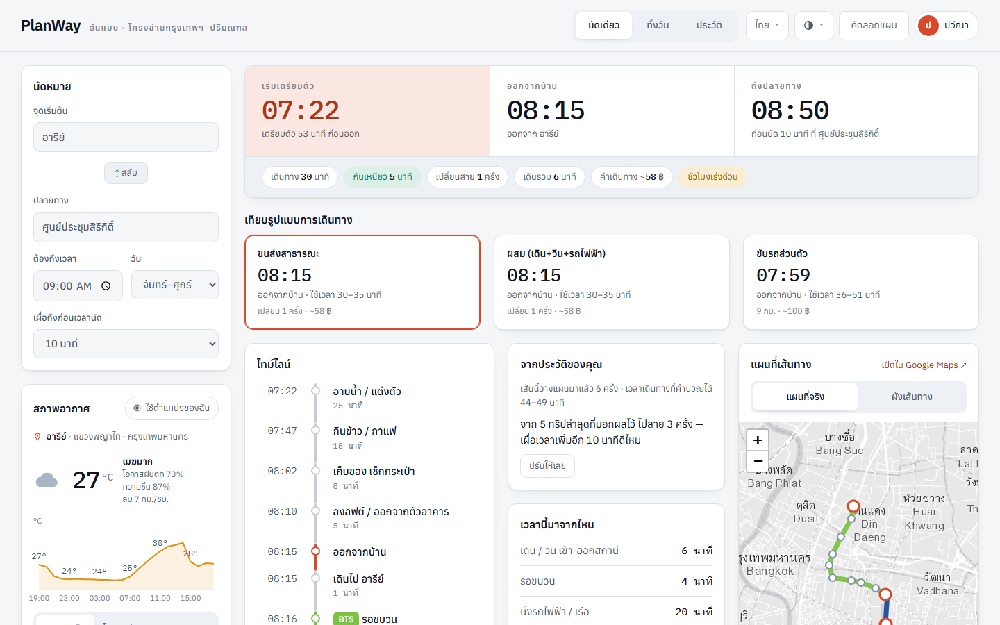
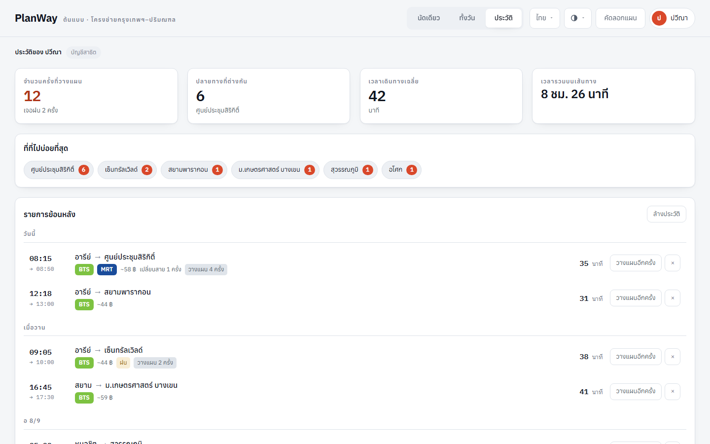
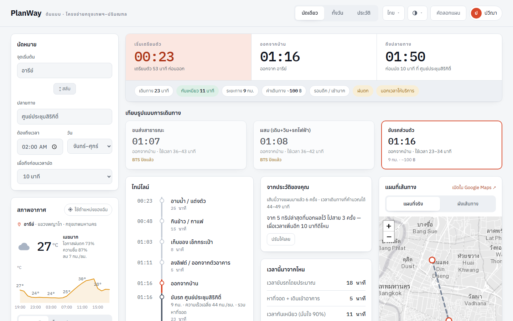
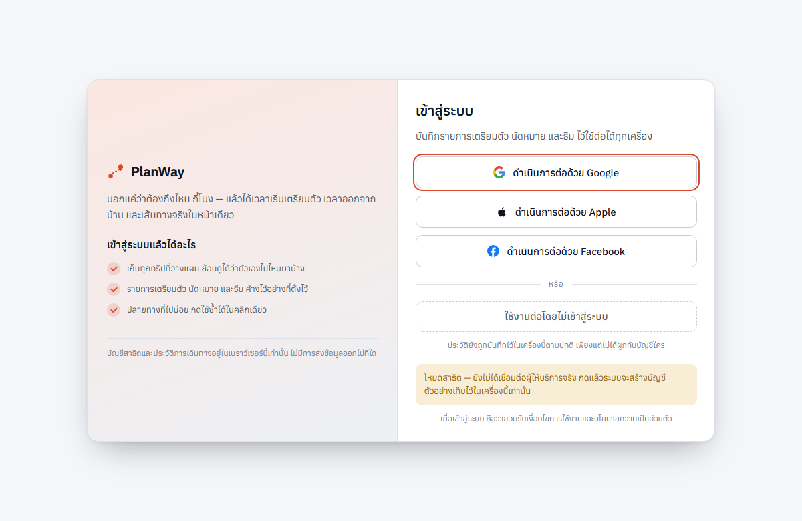
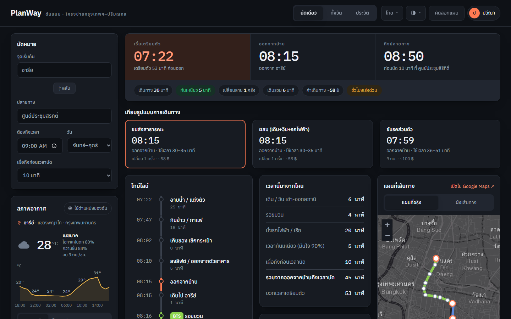
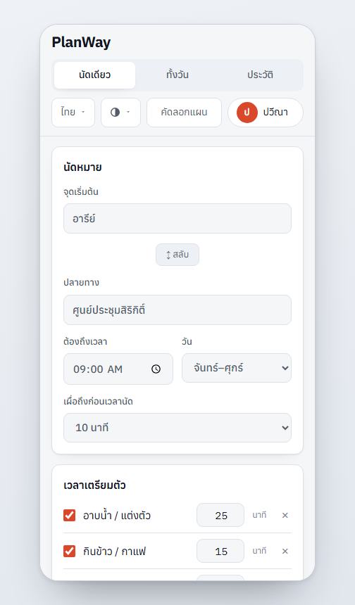
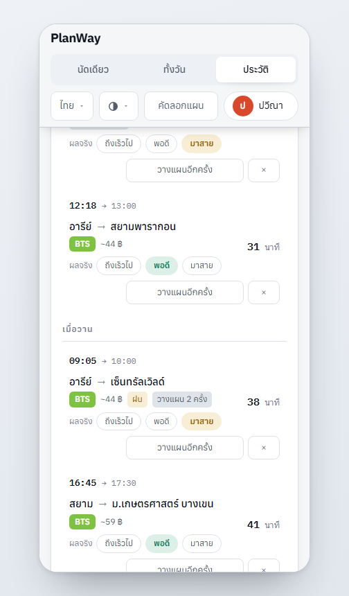

<div align="center">

# PlanWay

### บอกแค่ว่าต้องถึงไหน กี่โมง — ได้เวลาเริ่มเตรียมตัว เวลาออกจากบ้าน และเส้นทางจริง ในหน้าเดียว

เว็บวางแผนเวลาเดินทางบนโครงข่ายรถไฟฟ้า รถเมล์ และเรือ ของกรุงเทพฯ–ปริมณฑล<br>
เปิด `index.html` แล้วใช้ได้เลย ไม่ต้องลง dependency ไม่ต้องมี API key<br>
เขียนด้วย TypeScript แบบ strict คอมไพล์เป็นสคริปต์ธรรมดา ไม่มีเฟรมเวิร์ก ไม่มี bundler

<br>


<br>



</div>

<br>

## ปัญหาที่แก้

แอปแผนที่ทั่วไปตอบได้แค่ *"เดินทางกี่นาที"* แต่คำถามจริงของคนมีนัดคือ **"แล้วต้องลุกจากเตียงกี่โมง"**
PlanWay คิดย้อนกลับจากเวลานัด ผ่านเวลาเดินทาง เวลากันเหนียว และเวลาอาบน้ำแต่งตัว
จนได้เวลาที่ต้องเริ่มขยับจริง ๆ

และเพราะการเดินทางไม่ใช่ตัวเลขเดียวตายตัว ระบบจึงไม่ตอบเป็นค่าเฉลี่ย
แต่คิด**ความแปรปรวน**ของแต่ละช่วง (รอขบวน แกว่งกว่านั่งรถไฟฟ้า / ขับรถแกว่งที่สุด)
แล้วเผื่อเวลาให้ถึงทันที่ระดับความมั่นใจ 90%

<br>

## ทำอะไรได้บ้าง

| | |
| --- | --- |
| ⏱ **คำนวณย้อนหลังจากเวลานัด** | ได้เวลาเริ่มเตรียมตัว เวลาออกจากบ้าน พร้อมไทม์ไลน์ทีละขั้นและที่มาของทุกนาที |
| 🚉 **เส้นทางจริงบนโครงข่าย** | กราฟสถานี 185 แห่ง 11 สาย + Dijkstra คิดเวลารอขบวนตามความถี่และช่วงเวลา |
| 🗺 **แผนที่เลื่อน/ซูมได้** | Leaflet วาดเส้นทางที่คำนวณได้ทับลงไป คลิกสถานีเพื่อตั้งเป็นปลายทางได้ |
| 🌧 **สภาพอากาศตามพื้นที่จริง** | ดูเฉพาะ*ช่วงที่อยู่นอกบ้านจริง* ฝนตกบ่ายจึงไม่ไปเผื่อเวลาให้นัดเช้า |
| 🕘 **ประวัติการเดินทาง** | บันทึกให้เองทุกครั้งที่วางแผน ย้อนดูได้ว่าไปไหนบ่อย ใช้เวลาเฉลี่ยเท่าไร |
| 🌙 **รู้เวลาให้บริการ** | นัดตีสองจะไม่ถูกเสนอ BTS ที่ไม่มีอยู่จริง ระบบถอยไปคิดแบบขับรถให้เอง |
| 📈 **เรียนรู้จากตัวคุณ** | บอกผลจริงว่าไปสายหรือถึงเร็วไป แล้วระบบเสนอปรับเวลาเผื่อให้ตรงกับนิสัยคุณ |
| 🔍 **ค้นสถานที่ทั่วไทย** | ค้นสามชั้น ทนพิมพ์ผิด และเสนอชื่อใกล้เคียงให้กดเลือกเมื่อหาไม่เจอ |
| 🎨 **ธีมและภาษา** | สว่าง/มืด/ตามระบบ × 6 ชุดสี และสลับไทย–อังกฤษได้ทั้งหน้า รวมชื่อสถานี |
| 📱 **ใช้ได้ทุกจอ** | ตรวจด้วยภาพจริงตั้งแต่ 390px ถึง 1920px ไม่มีเลื่อนแนวนอน ไม่มีตัวหนังสือเล็กกว่า 11px |

<br>

## ภาพหน้าจอ

<table>
<tr>
<td width="50%" valign="top">
<b>ประวัติการเดินทาง</b><br>
<sub>สรุปสถิติ ปลายทางที่ไปบ่อย และรายการย้อนหลังที่กดบอกผลจริงได้ทีละทริป</sub><br><br>

</td>
<td width="50%" valign="top">
<b>รถหยุดวิ่งแล้ว</b><br>
<sub>นัดตีสอง — BTS ขึ้นว่าปิดแล้ว ระบบถอยไปคิดแบบขับรถ และเสนอปรับเวลาเผื่อจากประวัติ</sub><br><br>

</td>
</tr>
<tr>
<td width="50%" valign="top">
<b>หน้าเข้าสู่ระบบ</b><br>
<sub>เข้าด้วยบัญชี หรือกดใช้งานต่อโดยไม่ล็อกอินก็ได้</sub><br><br>

</td>
<td width="50%" valign="top">
<b>โหมดมืด</b><br>
<sub>แผนที่สลับชุด tile ตามธีม ไม่ได้ใช้ CSS filter กลับสีทับ</sub><br><br>

</td>
</tr>
<tr>
<td width="50%" valign="top">
<b>บนมือถือ</b><br>
<sub>ยุบเหลือคอลัมน์เดียว ปุ่มยังกดถนัด ไม่มีเลื่อนแนวนอน</sub><br><br>

</td>
<td width="50%" valign="top">
<b>บอกผลจริงบนมือถือ</b><br>
<sub>ปุ่ม ถึงเร็วไป / พอดี / มาสาย ตกบรรทัดเองโดยไม่บีบเนื้อหา</sub><br><br>

</td>
</tr>
</table>

<br>

## เริ่มใช้งาน

ดับเบิลคลิก `index.html` ก็ทำงานเลย — `js/` ที่คอมไพล์แล้วถูก commit ขึ้น repo ด้วย
และเป็นสคริปต์ธรรมดา ไม่ใช่ ES module จึงเปิดจาก `file://` ได้โดยไม่ต้องติดตั้งอะไรเลย

**ถ้าจะแก้โค้ด** ซอร์สอยู่ที่ `src/*.ts` ต้องคอมไพล์ก่อนถึงจะเห็นผล:

```bash
npm install     # ลง TypeScript ตัวเดียว ไม่มี dependency อื่น
npm run dev     # tsc --watch + เสิร์ฟที่ http://localhost:5173
```

หรือแยกเป็นคำสั่งย่อย: `npm run build` (คอมไพล์รอบเดียว), `npm run watch`,
`npm run typecheck` (ตรวจชนิดอย่างเดียว ไม่เขียนไฟล์)

รันเทสต์เอนจิน — คอมไพล์ให้ก่อนแล้วเทียบผลกับเวลาเดินทางจริง ไม่ต้องมีเบราว์เซอร์:

```bash
npm test
```

> ตัวแอปทำงานได้ครบจาก `file://` แต่ถ้าจะเอาขึ้นเว็บจริงต้องเสิร์ฟผ่าน **https**
> ไม่งั้นปุ่ม "ใช้ตำแหน่งของฉัน" จะใช้ไม่ได้ เพราะ `navigator.geolocation` ต้องการ secure context

### บริการภายนอกที่เรียก — ฟรีและไม่ต้องใช้ key ทั้งหมด

| บริการ | ใช้ทำอะไร | ถ้าเรียกไม่ได้ |
| --- | --- | --- |
| [Open-Meteo](https://open-meteo.com) | พยากรณ์อากาศรายชั่วโมง/รายวัน | แจ้งเตือนแล้วให้ตั้งฝนเอง |
| [BigDataCloud](https://www.bigdatacloud.com) | แปลงพิกัดเป็นชื่อเขต/จังหวัด | ถอยไปใช้ชื่อสถานีที่ใกล้ที่สุด |
| [Photon](https://photon.komoot.io) / [Nominatim](https://nominatim.org) | ค้นหาสถานที่ทั่วไทย | ยังค้นชื่อในเครื่องได้ตามปกติ |
| [Esri Canvas](https://www.esri.com) + [Leaflet](https://leafletjs.com) | แผนที่ฐานและการเลื่อน/ซูม | ซ่อนแท็บแผนที่จริง เหลือผังเส้นทาง SVG |

ทุกตัวถอยกลับได้หมด ตัดเน็ตแล้วแกนหลัก (คำนวณเวลา + ผังเส้นทาง) ยังทำงานครบ

<br>

## โครงไฟล์

```
index.html          โครงหน้าและลำดับการโหลดสคริปต์
css/styles.css      โทเคนสี/ระยะห่าง/ขนาดตัวอักษร, กริดหลัก, การ์ด, เมนู popover, หน้าล็อกอิน, ประวัติ
src/prefs.ts        ธีม / สีหลัก / ภาษา / บัญชีผู้ใช้ — โหลดใน <head> เพื่อทาธีมก่อน paint แรก
src/data.ts         ชุดข้อมูล: สายรถไฟฟ้า/รถเมล์/เรือ สถานีและป้าย พิกัด ความถี่ ค่าโดยสาร จุดเชื่อมต่อ แนวแม่น้ำ
src/i18n.ts         พจนานุกรมไทย/อังกฤษ + ชื่อสถานีและสถานที่ภาษาอังกฤษครบ 185 รายการ
src/history.ts      ประวัติการเดินทาง — เก็บแยกตามผู้ใช้ กันซ้ำ และสรุปสถิติ
src/places.ts       ค้นหาสถานที่ทั่วไทย (Photon + Nominatim) + ค้นในเครื่องแบบทนคำผิด
src/map.ts          แผนที่จริงแบบเลื่อน/ซูมได้ (Leaflet + Esri Canvas) วาดเส้นทางที่คำนวณได้ทับ
src/weather.ts      พยากรณ์อากาศจริงตามพื้นที่ (Open-Meteo) + ชื่อเขต (BigDataCloud) + แคช + ไอคอน
src/engine.ts       กราฟสถานี, Dijkstra, โมเดลเวลา/ความแปรปรวน — ไม่แตะ DOM เลย
src/app.ts          state, การคำนวณย้อนหลัง, การวาดหน้าจอทั้งหมด, การผูกอีเวนต์
src/types.d.ts      ชนิดที่ใช้ร่วมกันข้ามไฟล์ + ประกาศตัวแปร global ที่แต่ละไฟล์แขวนไว้บน window
js/*.js             ผลลัพธ์จาก tsc (commit ขึ้น repo ด้วย เพื่อให้ดับเบิลคลิก index.html ได้เลย) — อย่าแก้ตรงนี้
test/engine.test.js เทสต์เทียบเวลาเดินทางจริง 8 เส้นทาง + เคสกันบั๊ก 3 + เวลาให้บริการ 9 เคส
dev.mjs             dev server + tsc --watch ในคำสั่งเดียว เขียนด้วย stdlib ของ Node ล้วน
tsconfig.json       strict ทั้งชุด, target ES2020, src → js
```

`src/engine.ts` แยกจาก DOM โดยเจตนา — ย้ายไปรันบน Node/Cloudflare Worker ได้ทั้งไฟล์
ถ้าจะทำฝั่งเซิร์ฟเวอร์ในอนาคต

<br>

---

<br>

## รายละเอียดเชิงเทคนิค

<details>
<summary><b>เอนจินคำนวณเวลา</b> — กราฟสถานี Dijkstra และโมเดลความแปรปรวน</summary>

<br>

1. **สร้างกราฟ** จาก `LINES` (สถานีต่อกันตามลำดับ) + `TRANSFERS` (เดินเปลี่ยนสาย) + `EXTRA_EDGES` (ปิดลูปสายสีน้ำเงิน)
   เวลาแต่ละช่วง = ระยะทางวงกลมใหญ่ ÷ ความเร็วเฉลี่ยของสาย + เวลาจอด 0.45 นาที/สถานี

2. **หาสถานีที่ขึ้นได้** จากจุดตั้งต้น (`near()`) — เดิน 13 นาที/กม. และถ้าเส้นทางเดินตัดแม่น้ำเจ้าพระยา
   (`crossesRiver()`) จะคิดเวลา × 2.5 + 12 นาที เพราะต้องอ้อมไปขึ้นสะพาน

3. **Dijkstra** แบบหลายต้นทาง–หลายปลายทาง คิดเวลารอขบวนตอน "ขึ้นสายใหม่" เท่านั้น
   (`waitFor()` = ความถี่ ÷ 2 และบวก 0.6 นาทีในชั่วโมงเร่งด่วน เพราะมักตกขบวนแรก)

4. **เลือกทางด้วยต้นทุนจริง ไม่ใช่นาทีล้วน ๆ** — เดิมเอนจินเลือกเส้นทางที่เวลาน้อยที่สุดตรง ๆ
   แล้วได้คำตอบที่ถูกต้องตามเลขแต่ไม่มีใครทำจริง: เดิน 22 นาทีไปขึ้นรถไฟฟ้า ทั้งที่ BRT
   จอดอยู่ตรงต้นทาง หรือเปลี่ยนสาย 3 ต่อจ่าย 98 บาท เพื่อให้ถึงเร็วขึ้น 4 นาที
   ตอนค้นหาจึงถ่วงเพิ่มสามอย่าง

   | ค่าถ่วง | ค่า | เหตุผล |
   | --- | --- | --- |
   | `WALK_W` | 1.45 | เดิน 10 นาทีไม่เท่านั่งรถ 10 นาที — แดด ฝน ของหนัก บันได |
   | `XFER_P` | 4.0 นาที | เปลี่ยนสายหนึ่งครั้งเสียมากกว่าเวลาเดิน: หาชานชาลา ลุ้นว่าจะทัน |
   | `BAHT_M` | 0.22 นาที/บาท | ค่าแรกเข้า 17 บาท ≈ เสียเวลา 3.7 นาที กันไม่ให้แผนแพงกว่าเท่าตัวชนะเพราะเร็วกว่านิดเดียว |

   ค่าแรกเข้าถูกคิดตอนขึ้นสายใหม่ทุกครั้ง (`boardCost()`) เพราะเวลารอกับค่าแรกเข้ามาคู่กันเสมอ

   > ค่าถ่วงพวกนี้อยู่ใน **คะแนนที่ใช้เลือกทาง** เท่านั้น เวลาและค่าโดยสารที่แสดงให้ผู้ใช้
   > ถูกคำนวณใหม่จากขาจริงทั้งหมดใน `transitPlan()` — มีเทสต์จับไว้ว่าผลรวมของทุกขา
   > ต้องเท่ากับเวลารวมที่รายงานเป๊ะ ๆ ค่าถ่วงรั่วเข้ามาเมื่อไหร่เทสต์แดงทันที

5. **โมเดลความแปรปรวน** — หัวใจของโปรดักต์ ระบบไม่ตอบเป็นตัวเลขเดียว
   แต่รวมค่าเบี่ยงเบนมาตรฐานของแต่ละช่วง (รอรถแกว่งมากกว่านั่งราง, รถเมล์แกว่งกว่าราง ~2.5 เท่า,
   ขับรถแกว่งที่สุด) บวกความคลาดเคลื่อนพื้นฐาน 2.2 นาที แล้วคิดเวลากันเหนียว = `z(ความมั่นใจ) × sd`

   > ปุ่มเลือก **ระดับความมั่นใจ** (พอดี / 80% / 90% / 95%) ถูกถอดออกจากหน้าจอแล้วตามที่ผู้ใช้ขอ
   > ตัวโมเดลยังทำงานเหมือนเดิมโดยตรึงไว้ที่ **90%** (`S.conf` ใน `src/app.ts`)
   > ถ้าอยากเปิดให้เลือกอีกครั้ง เพิ่มปุ่ม `data-conf` กลับเข้าไปใน `index.html` — ข้อความในพจนานุกรม
   > (`conf.*`, `confnote.*`) ยังอยู่ครบทั้งสองภาษา

6. **คำนวณย้อนหลัง** เวลานัด → หักเวลาเผื่อถึงก่อน → หักเวลาเดินทาง+กันเหนียว = **เวลาออก**
   → หักเวลาเตรียมตัว = **เวลาเริ่มเตรียมตัว**
   ช่วงเวลา (เร่งด่วน/ปกติ/ดึก) ขึ้นกับเวลาออก ซึ่งขึ้นกับผลลัพธ์ จึงวนคำนวณซ้ำ 3 รอบให้ลงตัว

</details>

<details>
<summary><b>รถเมล์และ BRT</b> — สายที่วิ่งบนถนน ต่างจากรางตรงไหน</summary>

<br>

ชุดข้อมูลมีรถเมล์ 6 สายที่คนใช้มากและเส้นทางนิ่งมานาน เก็บเฉพาะป้ายหลักที่ใช้เป็นหมุดหมาย
ไม่ใช่ทุกป้ายตลอดสาย แบบเดียวกับที่รถไฟฟ้าเก็บเฉพาะสถานี

| สาย | ช่วง | หมายเหตุ |
| --- | --- | --- |
| BRT | สาทร – ราชพฤกษ์ | ช่องทางเดินรถแยก ความเร็วจึงคงที่กว่าสายอื่น |
| 29 | ฟิวเจอร์พาร์ค รังสิต – หัวลำโพง | แนวพหลโยธิน |
| 25 | ปากน้ำ – ท่าช้าง | แนวสุขุมวิท ต่อเข้าเมืองเก่า |
| 8 | แฮปปี้แลนด์ – สะพานพุทธ | แนวลาดพร้าว–ดินแดง–ประตูน้ำ |
| 510 | ม.ธรรมศาสตร์ ศูนย์รังสิต – อนุสาวรีย์ชัยฯ | ขึ้นทางด่วน หยุดน้อย |
| 511 | ปากน้ำ – สายใต้ใหม่ | พาดขวางเมืองตะวันออก–ตะวันตก |

### สิ่งที่รถเมล์บังคับให้เอนจินเปลี่ยน

**ความเร็วไม่คงที่ทั้งวัน** รถไฟฟ้าวิ่งเท่าเดิมตลอด แต่รถเมล์ชั่วโมงเร่งด่วนช้ากว่าตอนดึกเกือบครึ่ง
ถ้าใช้ค่าเดียวเหมือนราง เวลาจะผิดทางใดทางหนึ่งเสมอ สายที่วิ่งบนถนนจึงมีฟิลด์เพิ่มมาหนึ่งตัว

```js
spb:[26,38,48]     // km/h ตาม [เร่งด่วน, ปกติ, ดึก] — มีค่านี้ = เอนจินถือว่าเป็นสายบนถนน
```

เวลานั่งของสายที่มี `spb` ถูกคิดใหม่ตอนค้นเส้นทาง ไม่ได้ตรึงไว้ตั้งแต่ตอนสร้างกราฟเหมือนราง
ค่าชุดนี้กลืนความคลาดเคลื่อนของระยะทางไว้ด้วย เพราะเอนจินวัดระยะเป็นเส้นตรงระหว่างป้าย
ขณะที่ถนนจริงคดเคี้ยวกว่านั้น — ใครจับเวลาสายไหนได้จริง แก้สามตัวนี้ตัวเดียวจบ ไม่ต้องไปยุ่งที่อื่น

**ความแปรปรวนสูงกว่า** ค่าเบี่ยงเบนของขารถเมล์ตั้งไว้ที่ราว 2.5 เท่าของราง และฝนตกคูณเพิ่มอีก
p90 ของเส้นทางที่มีรถเมล์จึงถ่างกว่าเส้นทางรางที่ใช้เวลาเฉลี่ยเท่ากัน ซึ่งตรงกับของจริง

**จุดต่อรถไม่ต้องเขียนมือ** รถไฟฟ้ายังใช้ `TRANSFERS` เขียนทีละคู่ เพราะทางเชื่อมในสถานีอ้อมกว่า
ระยะเส้นตรงมาก (เพชรบุรี → มักกะสัน เดิน 6 นาที ทั้งที่ห่างไม่ถึง 300 เมตร) แต่ป้ายรถเมล์ไม่มี
ทางเชื่อมพิเศษอะไร เอนจินจึงจับคู่ให้เองตอนโหลด: ป้ายที่ห่างกันไม่เกิน 320 เมตรและไม่ต้องข้ามแม่น้ำ
ถือว่าต่อกันได้ คิดเวลาเดินจากระยะจริง ทำให้เพิ่มสายใหม่แล้วไม่ต้องไล่เขียนจุดตัดกับรางทุกจุด

### เพิ่มสายเอง

เหมือนเพิ่มสายรถไฟฟ้า ต่างกันแค่ใส่ `spb` ด้วย:

```js
bus40:{n:"รถเมล์ สาย 40",tag:"40",c:"#...",cd:"#...",sp:15,spb:[11,15,21],
       hw:[8,12,20],svc:[300,1380],fare:[13,2,25],st:[ ["ป้าย",13.75,100.53], … ]},
```

`fare:[ค่าแรกเข้า, ต่อป้าย, เพดาน]` — รถเมล์ที่เก็บราคาเดียวตลอดสายใส่เป็น `[15,0,15]` ได้เลย

> ข้อมูลรถเมล์ในนี้เป็นชุดตั้งต้น ขสมก. มีกว่า 200 สายและปรับทางเดินรถบ่อย
> รุ่นใช้งานจริงควรดึง GTFS ของ ขสมก./กรมการขนส่งทางบก มาแทนทั้งก้อน แทนที่จะไล่พิมพ์เอง

> ตอนนี้ชุดข้อมูลครอบคลุมแค่กรุงเทพฯ–ปริมณฑล สายในต่างจังหวัดใส่ได้เหมือนกัน
> แต่จะกลายเป็นโครงข่ายแยกเกาะจนกว่าจะมีสถานที่ในจังหวัดนั้นใน `PLACES` ให้ค้นเจอ

</details>

<details>
<summary><b>เวลาให้บริการ</b> — ไม่เสนอขบวนที่ไม่มีอยู่จริง</summary>

<br>

เดิมเอนจินไม่รู้ว่ารถหยุดวิ่งกี่โมง นัดตีสองจึงถูกเสนอเส้นทาง BTS ที่ตอนนั้นไม่มีขบวนแล้ว
ตอนนี้แต่ละสายใน `LINES` มีฟิลด์ `svc:[เปิด, ปิด]` เป็นนาทีจากเที่ยงคืน

| สาย | เวลาให้บริการที่ใช้ |
| --- | --- |
| BTS สุขุมวิท | 05:15 – เที่ยงคืน |
| BTS สีลม · MRT น้ำเงิน/ม่วง · ARL | 05:30 – เที่ยงคืน |
| สายสีทอง · เหลือง · ชมพู | 06:00 – เที่ยงคืน |
| รถไฟฟ้าสายสีแดง | 05:00 – เที่ยงคืน |
| เรือด่วนเจ้าพระยา | 06:00 – 19:00 |

`svcCheck(plan, leaveMin)` เดินเวลาจากนาทีที่ออกจากบ้าน บวกไปทีละช่วงแบบเดียวกับที่ไทม์ไลน์วาด
แล้วดูว่าตอนถึงคิวขึ้นรถแต่ละขา สายนั้นยังเปิดอยู่ไหม (ช่วง `wait` มาก่อน `ride` เสมอ
เวลา ณ ขา `ride` จึงเป็นเวลาที่ขึ้นรถจริง)

ถ้ามีขาไหนติด `compute()` จะ**ถอยไปใช้แผนขับรถ**ซึ่งใช้ได้ตลอด 24 ชั่วโมง แล้วขึ้นป้าย
"นอกเวลาให้บริการ" กับคำอธิบายว่าติดสายไหน เวลาเท่าไร ส่วนการ์ดเปรียบเทียบโหมดจะจางลง
และเขียนว่า "BTS ปิดแล้ว" แทนค่าโดยสาร

> เป็น**เวลาให้บริการที่ผู้ให้บริการประกาศ ไม่ใช่ตารางเดินรถจริง** จึงใช้เตือนและถอยแผนเท่านั้น
> ยังไม่รู้ว่าขบวนสุดท้ายของแต่ละสถานีปลายทางออกกี่โมง และไม่รู้เรื่องปิดซ่อมบำรุง

</details>

<details>
<summary><b>เรียนรู้จากตัวผู้ใช้</b> — ทำไมต้องถาม ไม่ใช่เดาเอง</summary>

<br>

ระบบมองไม่เห็นว่าผู้ใช้ไปถึงที่หมายจริงกี่โมง เดาเองจึงไม่ได้ ต้องให้ผู้ใช้บอก
ทุกทริปในหน้าประวัติ (เฉพาะที่ผ่านไปแล้ว) จึงมีปุ่มสามปุ่ม **ถึงเร็วไป / พอดี / มาสาย**
กดซ้ำที่เดิมคือยกเลิกคำตอบ

`histAdvice()` ดู 12 ทริปล่าสุดที่มีคำตอบ แล้วเสนอปรับ "เวลาเผื่อถึงก่อนนัด"

| สัดส่วน | ข้อเสนอ |
| --- | --- |
| มาสาย ≥ 40% | เพิ่ม 10 นาที |
| มาสาย ≥ 20% | เพิ่ม 5 นาที |
| ถึงเร็วไป ≥ 60% | ลด 5 นาที |
| นอกจากนั้น | ไม่ต้องปรับ |

ฝั่ง "มาสาย" ไวกว่าฝั่ง "เร็วไป" ตั้งใจให้ไม่สมมาตร เพราะโทษของการไปสายหนักกว่าการไปถึงเร็วเกิน

ผลออกมาเป็นข้อความในการ์ด **จากประวัติของคุณ** พร้อมปุ่ม *ปรับให้เลย* —
**เสนอ ไม่ใช่แอบปรับ** ถ้าเปลี่ยนเวลาให้เองเงียบ ๆ ผู้ใช้จะเห็นตัวเลขขยับโดยไม่รู้สาเหตุ
ช่องเผื่อเวลาเป็น select ที่มีค่าเป็นขั้น (0/5/10/15/30) `cushionStep()` จึงเลื่อนไปขั้นถัดไป
ในทิศที่ต้องการ ถ้าสุดขั้นแล้วก็ซ่อนปุ่มไปเลย

การ์ดเดียวกันยังบอกสถิติของเส้นทางที่กำลังวางแผนอยู่ด้วย เช่น
"เส้นนี้วางแผนมาแล้ว 6 ครั้ง · เวลาเดินทางที่คำนวณได้ 44–49 นาที"

> กับดักที่เจอตอนตรวจด้วยภาพ: การบันทึกอัตโนมัติเขียนทับทริปเดิมที่มี `sig` เดียวกัน
> ผลจริงที่ผู้ใช้เพิ่งกดจึงหายไปต่อหน้า `histAdd()` ตอนนี้คัด `out` ของเดิมเก็บไว้เสมอ
> เพราะเป็นข้อมูลชิ้นเดียวในระบบที่สร้างขึ้นเองไม่ได้

</details>

<details>
<summary><b>ย้ายประวัติข้ามเครื่อง</b> — ไฟล์ JSON แทนการซิงก์</summary>

<br>

ยังไม่มี backend ให้ซิงก์ ระหว่างนี้หน้าประวัติมีปุ่ม **ส่งออกไฟล์** กับ **นำเข้าไฟล์**

ส่งออกเป็น JSON ธรรมดาที่อ่านออกด้วยตาและแก้เองได้ ไม่ผูกกับรูปแบบภายในของเรา
ส่วนการนำเข้าจะ**รวมแบบไม่ทับของเดิม** — ทริปที่มีอยู่แล้ว (วันที่ + ต้นทาง + ปลายทางเดียวกัน)
จะถูกข้าม แล้วคืนจำนวนที่เพิ่มเข้ามาจริงไปแสดงบนปุ่ม ไฟล์ที่ไม่ใช่ของ PlanWay จะถูกปฏิเสธ
ไม่ใช่เขียนทับข้อมูลเดิมทิ้ง

</details>

<details>
<summary><b>เลย์เอาต์และ Responsive</b> — โทเคนขนาด กริด 4 ระดับ และกับดักที่เจอ</summary>

<br>

ทุกอย่างคุมด้วย custom property ที่หัวไฟล์ `css/styles.css` ไม่มีการตรึงความกว้างเป็น px
ในเลย์เอาต์หลักอีกแล้ว ถ้าจะปรับสเกลทั้งระบบให้แก้ที่โทเคนชุดนี้ที่เดียว

```
--gut   clamp(16px,2.1vw,56px)   ขอบซ้าย-ขวาของหน้า
--gap   clamp(14px,1.35vw,22px)  ช่องไฟระหว่างการ์ด
--pad   clamp(16px,1.15vw,22px)  padding ในการ์ด
--fs-*  ขนาดตัวอักษร (body 15 / หัวข้อการ์ด 15.5 / รอง 13 / metadata 12 / KPI clamp 30–44)
--primary  #2563EB  สีของการกระทำ (ปุ่มหลัก ตัวเลือกที่เลือกอยู่) คงที่ทุกธีม
           แยกจาก --accent ซึ่งผู้ใช้เปลี่ยนได้ 6 ชุด — ปุ่ม "วางแผนเส้นทาง" จึงเป็นสีเดียวเสมอ
--ctl-h 42px                     ความสูงมาตรฐานของ input และปุ่มทุกตัว
```

คอนเทนเนอร์คือ `.wrap` — `width:100%` ไม่จำกัด `max-width` เนื้อหาจึงกินเต็มจอทุกขนาด
โดยมี `--gut` เป็นตัวคุมไม่ให้ตัวหนังสือชนขอบ

**ระดับความกว้าง 4 ชั้น** (ทุก media query ในไฟล์อิงชุดนี้)

| ความกว้าง | โครง |
|---|---|
| ≥ 1200 | ส่วนค้นหา → คำตอบ → ตัวเลือกเส้นทาง → ไทม์ไลน์ 40% │ แผนที่ 60% |
| 1024–1199 | คอลัมน์เดียว ไทม์ไลน์ขึ้นก่อน แผนที่ตามลงมา (`.sright{order:2}`) |
| 768–1023 | ช่องเวลาในส่วนค้นหายุบเหลือ 2 ต่อแถว แท็บและเครื่องมือย้ายไปหลังปุ่มเมนู |
| < 768 | ทุกช่องเต็มแถว การ์ดคำตอบเรียงลงล่าง |

**ลำดับของหน้าคือลำดับคำถามของผู้ใช้** — จะไปไหน (ส่วนค้นหา) → ต้องออกจากบ้านกี่โมง (คำตอบ
ตัวใหญ่ที่สุดในหน้า) → ไปทางไหนได้บ้าง (แถวตัวเลือกเส้นทาง) → เดินทางยังไง (ไทม์ไลน์) →
อยู่ตรงไหนบนแผนที่ (แผนที่ ซึ่งกินพื้นที่มากที่สุด)

แผนที่ได้ 60% เพราะเป็นสิ่งเดียวในหน้าที่ตอบคำถาม "ตรงนั้นอยู่ตรงไหน" ได้ ส่วนไทม์ไลน์
เป็นข้อความล้วนซึ่งอ่านได้ในคอลัมน์แคบอยู่แล้ว

รายละเอียดที่ไม่ได้ช่วยตัดสินใจตั้งแต่แรก — ที่มาของเวลา ข้อควรรู้ เวลาเตรียมตัว กราฟอากาศ —
ถูกยุบไว้ใน `<details class="more">` ใต้ไทม์ไลน์ ยังอยู่ครบทุกอย่าง แต่ไม่แย่งความสนใจตอนเปิดหน้า

> ตัวหนังสือใน SVG (แผนที่เส้นทางและกราฟอากาศ) **ไม่รับขนาดจาก CSS**
> ต้องแก้ที่ตัวแปร `FS` ใน `renderMap()` และค่า `font-size` ใน `renderWxChart()` ของ `src/app.ts`
> ทั้งสองที่ผูกขนาดไว้กับความกว้างจริงของช่องที่วาง จึงคมทุกขนาดจอ

> กฎ CSS ที่กวาดกว้างเกินไปเคยทำให้พัง — `.mapwrap svg{width:100%}` ไปโดน `<svg>` ที่ Leaflet
> สร้างเองด้วย ทั้งไอคอนใน attribution และชั้นวาด vector ผลคือมีบล็อกสีประหลาดเต็มการ์ด
> และเส้นทางไม่ขึ้นบนแผนที่เลย ต้องเจาะจงเป็น `#mapHost svg` เท่านั้น

</details>

<details>
<summary><b>ธีม ภาษา และบัญชีผู้ใช้</b> — ทาสีก่อน paint แรก และกฎเรื่องคีย์ชื่อสถานี</summary>

<br>

**ธีม** — เลือกได้ 3 โหมด (ตามระบบ / สว่าง / มืด) คูณกับสีหลัก 6 ชุด (ส้มอิฐ น้ำเงิน เขียว ม่วง ชมพู เทาหิน)
สีหลักแต่ละชุดมีคู่สีของโหมดสว่างและโหมดมืดแยกกัน กำหนดไว้ที่ `ACCENTS` ใน `src/prefs.ts`
`applyPrefs()` เขียนทับตัวแปร `--accent` `--accent2` `--accent-soft` `--on-accent` บน `:root`
ไฟล์นี้จึงต้องโหลดแบบ blocking ใน `<head>` ไม่งั้นหน้าจะกระพริบเป็นสีเดิมก่อนหนึ่งเฟรม

**ภาษา** — ไทย/อังกฤษ ทุกข้อความในหน้าอยู่ใน `STR` ของ `src/i18n.ts` (277 คีย์ ครบเท่ากันทั้งสองภาษา)
กฎเดียวที่ต้องรักษาคือ *ห้ามเขียนข้อความตรงๆ ใน `app.js`* — ต้องผ่าน `t("key")` และ
ชื่อสถานีทุกจุดต้องผ่าน `sname()` เสมอ

> ชื่อสถานีภาษาไทยยังเป็น **คีย์จริงของกราฟ** อยู่ (`NODES` ใช้ชื่อไทยเป็น key)
> `sname()` แปลงเฉพาะตอนแสดงผล ส่วน `resolve()` รับได้ทั้งชื่อไทยและอังกฤษโดยแปลงกลับผ่าน `NAME_TH`
> ถ้าเพิ่มสถานีใน `data.js` ต้องเพิ่มชื่ออังกฤษใน `NAME_EN` ด้วย ไม่งั้นโหมดอังกฤษจะแสดงชื่อไทยแทน

**บัญชีผู้ใช้** — ปุ่ม Google / Apple / Facebook ตอนนี้เป็น **โหมดสาธิต**
กดแล้วสร้างโปรไฟล์ตัวอย่างเก็บใน `localStorage` เท่านั้น ยังไม่ได้ยิงไปหาผู้ให้บริการจริง
จุดเสียบของจริงมีที่เดียวคือ `signInWith()` ใน `src/prefs.ts` (มีคอมเมนต์บอก SDK และลำดับขั้นไว้แล้ว)

> ทั้งสามเจ้าต้องมี backend — เบราว์เซอร์ทำได้แค่รับ `id_token` / `access token`
> แล้วต้องส่งไป verify ฝั่งเซิร์ฟเวอร์และแลกเป็น session cookie แบบ httpOnly
> **ห้ามเก็บ client secret หรือ API key ไว้ในไฟล์ที่ส่งให้เบราว์เซอร์**

</details>

<details>
<summary><b>เข้าสู่ระบบและประวัติการเดินทาง</b> — การบันทึกอัตโนมัติ และการแยกถังตามผู้ใช้</summary>

<br>

### หน้าเข้าสู่ระบบ

**เข้าสู่ระบบไม่ใช่ด่านบังคับ** เปิดเว็บมาจะเจอหน้าหลักเสมอ ใช้งานได้ครบทุกอย่างโดยไม่ต้องมีบัญชี
หน้าเข้าสู่ระบบเต็มจอ (`#loginView`) ขึ้นเฉพาะตอนกดปุ่มบัญชีบนหัวจอ และปิดได้เสมอ —
กากบาท กด Esc หรือคลิกพื้นหลังก็ออก

บัญชีมีไว้แยกถังประวัติการเดินทางอย่างเดียว การบังคับล็อกอินก่อนจึงไม่ได้ปกป้องอะไร
มีแต่จะทำให้รีเฟรชทีหนึ่งหลุดออกจากหน้าหลักทีหนึ่ง กด **ออกจากระบบ** ก็ยังยืนอยู่หน้าเดิม
เปลี่ยนแค่ถังประวัติที่ใช้อยู่

### ประวัติเก็บอย่างไร

`src/history.ts` เก็บลง `localStorage` คีย์เดียวคือ `okd.hist.v1` เป็นอ็อบเจกต์ `{ uid: [entry, …] }`
โดย `uid` คือ `provider:email` ของผู้ที่ล็อกอินอยู่ หรือ `"guest"` ถ้ายังไม่ได้ล็อกอิน
แยกถังกันเพราะเครื่องเดียวอาจมีหลายคนสลับกันใช้ คนหนึ่งต้องไม่เห็นของอีกคน

| พฤติกรรม | รายละเอียด |
| --- | --- |
| บันทึกเมื่อไร | อัตโนมัติหลังคำนวณสำเร็จ ไม่มีปุ่ม "บันทึก" ให้ต้องจำว่าต้องกด |
| หน่วงเวลา | 2.2 วินาทีหลังหยุดพิมพ์ (`histTouch`) เพราะ `draw()` ถูกเรียกทุกตัวอักษร |
| กันซ้ำ | คีย์ `วันที่ \| ต้นทาง \| ปลายทาง` ทริปเดิมจะถูกอัปเดตทับ ไม่เพิ่มรายการใหม่ |
| นับจำนวนครั้ง | ปรับค่าในฟอร์มไปมาภายใน 30 นาทีนับเป็นครั้งเดียว เกินกว่านั้นจึงบวก `n` |
| เพดาน | 300 รายการต่อผู้ใช้ ของเก่าสุดถูกตัดทิ้งก่อน |
| ตอนล็อกอิน | `histClaimGuest()` **ย้าย** ประวัติจากถัง guest เข้าบัญชี (ย้าย ไม่ใช่ก๊อบ) แล้วบอกผู้ใช้ว่าย้ายไปกี่รายการ |

หนึ่งรายการเก็บเท่าที่ต้องใช้แสดงผล ไม่เก็บผลคำนวณทั้งก้อน เพราะ `localStorage` มีเพดานความจุ
ได้แก่ ต้นทาง/ปลายทาง (เก็บเป็น**ชื่อไทย**ซึ่งเป็นคีย์จริงของกราฟ แล้วค่อยแปลตอนแสดง)
เวลาออก/เวลาถึง/เวลาเตรียมตัว เวลาเดินทาง บัฟเฟอร์ โหมด รหัสสายที่ใช้ จำนวนครั้งที่เปลี่ยนสาย
ค่าโดยสาร ระยะทาง และฝนตกหรือไม่

### หน้าประวัติ

แท็บ **ประวัติ** มีสามส่วน คือการ์ดสรุปสี่ใบ (จำนวนครั้ง / ปลายทางที่ต่างกัน / เวลาเฉลี่ย / เวลารวม)
ชิปปลายทางที่ไปบ่อย (กดแล้วตั้งเป็นปลายทางทันที) และรายการย้อนหลังจัดกลุ่มตามวัน
แต่ละแถวกด **วางแผนอีกครั้ง** เพื่อโหลดค่าเดิมกลับเข้าฟอร์ม หรือกดกากบาทเพื่อลบทีละรายการ

แท็บนี้ซ่อนแผงตั้งค่าด้านซ้าย (`body.tab-hist .colside{display:none}`) เพราะไม่ได้ใช้เลย
และบนมือถือถ้าไม่ซ่อน ต้องเลื่อนผ่านฟอร์มทั้งหน้าก่อนจะเห็นประวัติ

> **ข้อจำกัดที่ต้องบอกผู้ใช้ให้ชัด** — ยังไม่มี backend ประวัติจึงอยู่ในเบราว์เซอร์นี้เท่านั้น
> ล้างข้อมูลเบราว์เซอร์แล้วหาย และเปิดอีกเครื่องจะไม่เห็น (มีบอกไว้ท้ายหน้าประวัติแล้ว)
> ถ้าต่อ backend จริง เปลี่ยนแค่ `histRead()` / `histWrite()` ให้ยิง `/api/history`
> โดยยืนยันตัวตนด้วย session cookie แบบ httpOnly **ห้ามส่ง token ผ่าน JS**

</details>

<details>
<summary><b>ค้นหาสถานที่</b> — ค้นสามชั้น ทนคำผิด และ "หมายถึง…?"</summary>

<br>

เดิมแอปรู้จักเฉพาะชื่อที่ฝังไว้ใน `data.js` คือสถานี 185 ชื่อกับสถานที่ยอดนิยม 24 ชื่อ
พิมพ์ชื่ออื่นแล้วขึ้น "ไม่พบจุดเริ่มต้น" ทันที `src/places.ts` แก้เรื่องนี้ด้วยการค้นสามชั้น

1. **ในเครื่องก่อนเสมอ** — ตรงตัว → ขึ้นต้นตรง → มีคำนั้นอยู่ → คล้ายพอ
   ชั้นสุดท้ายวัดด้วย LCS เทียบกับความยาวคำค้น จึงทนการพิมพ์ไม่ครบและสลับคำได้
   เช่น `"ตากอากาศบางปู"` เทียบกับ `"สถานตากอากาศบางปู"` ได้คะแนน 1.00 ทั้งที่ขึ้นต้นไม่เหมือนกัน
   ค้นได้ทั้งชื่อไทยและชื่ออังกฤษของสถานี

2. **Photon** (OpenStreetMap) — ออกแบบมาสำหรับ autocomplete โดยเฉพาะ จึงยิงระหว่างพิมพ์ได้
   หน่วง 220 มิลลิวินาที และทิ้งผลที่ตกรุ่นถ้าผู้ใช้พิมพ์ต่อไปแล้ว

3. **Nominatim** — ค้นชื่อบางส่วนแม่นกว่า แต่นโยบายห้ามเอาไปทำ autocomplete
   จึงยิงเฉพาะตอน Photon หาไม่เจอเท่านั้น (กรณี `"ตากอากาศบางปู"` คือตัวอย่างจริงที่ต้องใช้ชั้นนี้)

สถานที่ที่ผู้ใช้เลือกจากผลค้นหาจะถูกจำลง `localStorage` (`okd.places.v1`) เพราะ `resolve()`
ต้องหาพิกัดนั้นเจออีกเมื่อเปิดหน้าใหม่ ไม่งั้นจุดเริ่มต้นที่บันทึกไว้จะกลายเป็น "ไม่พบ"

ถ้าค้นไม่เจอจริง ๆ กล่องแจ้งเตือนจะเสนอชื่อใกล้เคียงให้กดเลือกได้เลย แทนที่จะบอกแค่ว่าไม่พบ

> สถานที่ที่อยู่นอกรัศมีเดินถึงสถานี (เช่น บางปู) จะไม่มีเส้นทางขนส่งสาธารณะ
> เอนจินจะถอยไปใช้แผนขับรถเองโดยอัตโนมัติ และขึ้นป้ายบอกไว้ในแถบสรุป

</details>

<details>
<summary><b>แผนที่</b> — ทำไมไม่ใช่ Google Maps และเลือก tile server อย่างไร</summary>

<br>

การ์ดแผนที่มีสองมุมมอง สลับได้ที่หัวการ์ด

1. **แผนที่จริง** — Leaflet ลากเลื่อนและซูมได้ วาดเส้นทางที่เอนจินคำนวณได้ทับลงไป
   (เส้นสีตามสายรถไฟฟ้า จุดสถานีคลิกตั้งเป็นปลายทางได้ เส้นประคือขาเดิน/วิน)
2. **ผังเส้นทาง** — SVG แบบเดิม ใช้ออฟไลน์ได้และเห็นโครงข่ายทั้งระบบ

ถ้าโหลด Leaflet จาก CDN ไม่ได้ แท็บแรกจะถูกซ่อนแล้วเหลือผังเส้นทางอย่างเดียว ไม่พัง

### ทำไมไม่ใช่ Google Maps

ทดสอบแล้วทั้งสองทางใช้ไม่ได้ถ้าไม่มี API key

| วิธี | ผลที่ได้ |
|---|---|
| Maps Embed API (`/maps/embed/v1/`) | **401** ต้องมี API key และเปิด billing |
| endpoint ไม่ใช้ key (`output=embed`) | 301 ไปยัง response ที่ติด `X-Frame-Options: SAMEORIGIN` ฝัง iframe แล้วขึ้นกรอบเปล่า |

จึงใช้ **Leaflet + Esri Canvas basemap** แทน ฟรี ไม่ต้องมี key และมีชุดโทนสว่างกับโทนมืดจริง ๆ
ให้สลับตามธีม (ไม่ต้องเอา CSS filter ไปกลับสีทับ) ข้อดีที่เหนือกว่า iframe ของ Google คือ
**วาดเส้นทางที่เราคำนวณเองทับลงไปได้** ส่วนใครอยากได้ Google ตัวจริง มีปุ่ม "เปิดใน Google Maps"
ที่หัวการ์ด เป็นลิงก์ธรรมดาไม่ต้องใช้ key

> เคยลอง `tile.openstreetmap.org` ก่อน แต่นโยบายเขาห้ามแอปอื่นใช้ tile server ตรง ๆ
> และเขาส่งภาพอื่นมาแทนแผนที่เมื่อตรวจพบ — เจอจริงตอนทดสอบ จึงเปลี่ยนมาใช้ Esri
> ถ้าจะขึ้นใช้งานจริงเชิงพาณิชย์ ควรอ่านเงื่อนไขของ Esri หรือย้ายไปใช้ tile server ของตัวเอง

</details>

<details>
<summary><b>สภาพอากาศ</b> — ทำไมถึงดูเฉพาะช่วงที่อยู่นอกบ้าน</summary>

<br>

ดึงพยากรณ์จริงจาก **Open-Meteo** (`src/weather.ts`) เลือกเจ้านี้เพราะไม่ต้องใช้ API key
ไม่ต้องมี backend และเปิด CORS ให้เรียกจากเบราว์เซอร์ตรง ๆ ต้นแบบจึงยังเปิดจาก `file://` ได้เหมือนเดิม

แผงสภาพอากาศประกอบด้วย ชื่อพื้นที่ · สภาพตอนนี้ (อุณหภูมิ ความชื้น ลม โอกาสฝน) ·
กราฟรายชั่วโมง 24 ชั่วโมงข้างหน้าที่สลับดูได้ 3 แบบ (อุณหภูมิ / โอกาสฝน / ลม) ·
การ์ดพยากรณ์ 7 วันที่กดเลือกได้ · และปุ่มตั้งเองทับค่าอัตโนมัติ

**พยากรณ์ปรับตามพื้นที่จริง** พิกัดที่ใช้คือพิกัดของ *จุดเริ่มต้น* ที่ผู้ใช้พิมพ์ ไม่ใช่กลางกรุงเทพฯ
ปุ่ม **ใช้ตำแหน่งของฉัน** เรียก `navigator.geolocation` แล้วตั้งจุดเริ่มต้นเป็นสถานี/สถานที่ที่ใกล้ที่สุด
ในชุดข้อมูลของเรา เส้นทางกับพยากรณ์จะได้อ้างอิงจุดเดียวกัน
ชื่อเขต/จังหวัดที่แสดงมาจาก **BigDataCloud** (ฟรี ไม่ต้องใช้ key เช่นกัน) ถ้าเรียกไม่สำเร็จก็ถอยไปใช้
ชื่อสถานีที่ใกล้ที่สุดแทน ไม่มีอะไรพัง

ขอทั้งพยากรณ์ **รายวัน 7 วัน** (ไว้วาดการ์ดเลือกวัน) และ **รายชั่วโมง** (ไว้ตัดสินจริงและวาดกราฟ)
แคชไว้ 30 นาทีใน `localStorage`

**สิ่งที่ทำให้ตัวเลขนี้ต่างจากแอปพยากรณ์อากาศทั่วไป** คือระบบไม่ได้ดูทั้งวัน
แต่ดูเฉพาะ *ช่วงที่ผู้ใช้อยู่นอกบ้านจริง* (เวลาออกจากบ้าน → เวลาถึง) ซึ่งได้จากผลคำนวณรอบก่อนหน้า
วันที่ฝนตกหนักตอนบ่ายจึงไม่ไปบวกเวลาเผื่อให้นัดตอนเช้า และในแท็บ "ทั้งวัน" แต่ละนัดคิดสภาพอากาศ
ของช่วงเวลาตัวเองแยกกัน

เกณฑ์ว่านับเป็น "วันฝนตก" คือ **ฝนสะสม ≥ 0.6 มม. หรือโอกาสฝน ≥ 60%** ในช่วงนั้น
(`wxIsRain()`) ตั้งไว้สูงพอที่ฝนปรอยจะไม่ทำให้ผู้ใช้ถูกสั่งให้ออกจากบ้านเร็วขึ้นโดยไม่จำเป็น
เมื่อเข้าเกณฑ์ เอนจินจะบวกเวลาเดิน 25% และเวลาขับรถ ~28% ตามเดิม

ผู้ใช้กด **ไม่มีฝน / ฝนตก** เพื่อทับค่าอัตโนมัติได้เสมอ และถ้าเน็ตล่มหรือ API ล่ม
หน้าจะแจ้งเตือนแล้วให้ตั้งเอง ไม่ค้างและไม่พัง

> ถ้าเปลี่ยนไปใช้เจ้าที่ต้องมี key (OpenWeather / AccuWeather) ต้องยิงผ่าน backend ของเราเอง
> ห้ามฝัง key ไว้ในไฟล์ที่ส่งให้เบราว์เซอร์

</details>

<details>
<summary><b>จุดที่ต้องเปลี่ยนเมื่อทำรุ่นใช้งานจริง</b> — เสียบ Routes API ตรงไหน และเรื่องแจ้งเตือน</summary>

<br>

ตัวเลขเวลาเดินทางในนี้เป็น **ค่าประมาณจากโมเดล ไม่ใช่ตารางเดินรถจริง**
สิ่งที่ควรแทนคือ *ชั้นหาเส้นทาง* เท่านั้น ส่วนโมเดลกันเหนียว/เวลาเตรียมตัว/แผนหลายนัด เก็บไว้ได้ทั้งหมด

### แทน `transitPlan()` และ `drivePlan()` ด้วย Google Routes API

จุดเสียบมีที่เดียว คือฟังก์ชันเหล่านี้ใน `src/engine.ts` โดยต้องคืนรูปแบบเดิม
`{ mean, sd, fare, segs, xfers, walk, wait, ride }`

```js
// ⚠️ อย่าใส่ API key ในเบราว์เซอร์ — ให้ยิงผ่าน backend ของเราเอง
async function transitPlanLive(from, to, arriveBy) {
  const res = await fetch('/api/route', {
    method: 'POST',
    headers: { 'Content-Type': 'application/json' },
    body: JSON.stringify({ from, to, arriveBy, mode: 'TRANSIT' })
  });
  const r = await res.json();              // ผลจาก Routes API ที่ backend ย่อยแล้ว
  const mean = r.durationMinutes;
  // Google ให้ค่ากลาง ไม่ให้ความแปรปรวน — ใช้โมเดลเดิมของเราประเมิน sd ต่อ
  const sd = Math.sqrt(2.2**2 + (r.transfers * 1.6)**2 + (mean * 0.09)**2);
  return { mean, sd, fare: r.fare, segs: r.steps, xfers: r.transfers, ...r.split };
}
```

Backend (Node/Express, Cloudflare Worker หรือ Firebase Function) เรียก
`POST https://routes.googleapis.com/directions/v2:computeRoutes`
ด้วย `travelMode: "TRANSIT"` + `arrivalTime` (Routes API รับเวลา *ถึง* ได้ ตรงกับโจทย์นี้พอดี)
และควร **cache ผลตามคู่ต้นทาง-ปลายทาง + ช่วงเวลา 15 นาที** เพราะโควตาฟรีคือ
~10,000 ครั้ง/เดือน แล้วคิด $5 ต่อ 1,000 ครั้ง

### การแจ้งเตือน

ทางที่เชื่อถือได้ที่สุดโดยไม่ต้องทำแอป native: **เขียน event ลงปฏิทินของผู้ใช้**
("06:35 เริ่มเตรียมตัว", "07:10 ออกจากบ้าน") — ผู้ใช้จะได้การปลุกจากระบบปฏิบัติการเอง
ไฟล์ `.ics` สร้างฝั่ง client ได้เลย ไม่ต้องมีเซิร์ฟเวอร์

</details>

<br>

## หมายเหตุเรื่องข้อมูล

ข้อมูลสถานี ความถี่ขบวน ค่าโดยสาร และเวลาให้บริการในไฟล์นี้ประกอบขึ้นเพื่อทดสอบตรรกะ
ตรวจกับเวลาเดินทางจริงแล้ว 8 เส้นทาง (ดู `test/engine.test.js`) คลาดเคลื่อนอยู่ในช่วงที่ยอมรับได้
แต่ **ไม่ควรใช้เป็นข้อมูลอ้างอิงกับผู้ใช้จริง** ก่อนเปลี่ยนไปใช้ GTFS หรือ Routes API

โดยเฉพาะเวลาให้บริการ — เป็นชั่วโมงเปิด-ปิดที่ผู้ให้บริการประกาศไว้กลม ๆ ระบบจึงรู้แค่ว่า
"ช่วงนี้ไม่มีรถแน่ ๆ" ยังไม่รู้ว่าขบวนสุดท้ายของแต่ละสถานีปลายทางออกกี่โมง
และไม่รู้เรื่องปิดซ่อมบำรุงหรือวันหยุดพิเศษ

ภาพหน้าจอในหน้านี้เป็นข้อมูลตัวอย่างที่สร้างขึ้นเพื่อการสาธิต ไม่ใช่ประวัติการเดินทางของผู้ใดจริง
